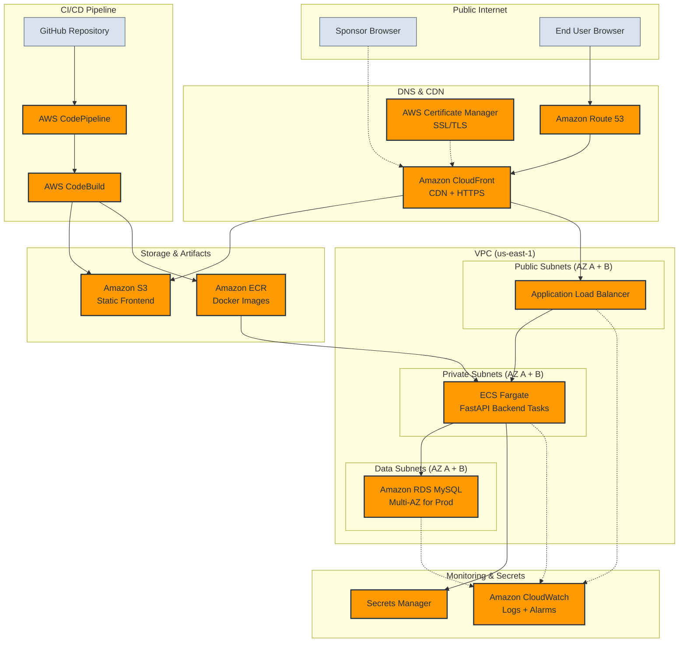

```mermaid
graph TB
    subgraph "Public Internet"
        Sponsor[Sponsor Browser]
        EndUser[End User Browser]
    end

    subgraph "DNS & CDN"
        Route53[Amazon Route 53]
        CloudFront[Amazon CloudFront<br/>CDN + HTTPS]
        ACM[AWS Certificate Manager<br/>SSL/TLS]
    end

    subgraph "VPC (us-east-1)"
        subgraph "Public Subnets (AZ A + B)"
            ALB[Application Load Balancer]
        end
        subgraph "Private Subnets (AZ A + B)"
            ECS[ECS Fargate<br/>FastAPI Backend Tasks]
        end
        subgraph "Data Subnets (AZ A + B)"
            RDS[Amazon RDS MySQL<br/>Multi-AZ for Prod]
        end
    end

    subgraph "Storage & Artifacts"
        S3_Frontend[Amazon S3<br/>Static Frontend]
        ECR[Amazon ECR<br/>Docker Images]
    end

    subgraph "CI/CD Pipeline"
        GitHub[GitHub Repository]
        CodePipeline[AWS CodePipeline]
        CodeBuild[AWS CodeBuild]
    end

    subgraph "Monitoring & Secrets"
        CloudWatch[Amazon CloudWatch<br/>Logs + Alarms]
        Secrets[Secrets Manager]
    end

    %% Traffic flows
    Route53 --> CloudFront
    CloudFront --> S3_Frontend
    CloudFront --> ALB
    ALB --> ECS
    ECS --> RDS
    ECS --> Secrets

    %% CI/CD flows
    GitHub --> CodePipeline
    CodePipeline --> CodeBuild
    CodeBuild --> S3_Frontend
    CodeBuild --> ECR
    ECR --> ECS

    %% ACM linked to CloudFront
    ACM -.-> CloudFront

    %% CloudWatch monitoring
    ECS -.-> CloudWatch
    RDS -.-> CloudWatch
    ALB -.-> CloudWatch

    %% Sponsor access in test deployment (IP restricted)
    Sponsor -.-> CloudFront
    EndUser --> Route53

    classDef aws fill:#FF9900,stroke:#232F3E,stroke-width:2px,color:#232F3E;
    classDef external fill:#D9E3F0,stroke:#4A5C6C,stroke-width:1px;
    class Route53,CloudFront,ACM,ALB,ECS,RDS,S3_Frontend,ECR,CodePipeline,CodeBuild,CloudWatch,Secrets aws;
    class GitHub,Sponsor,EndUser external;
```
